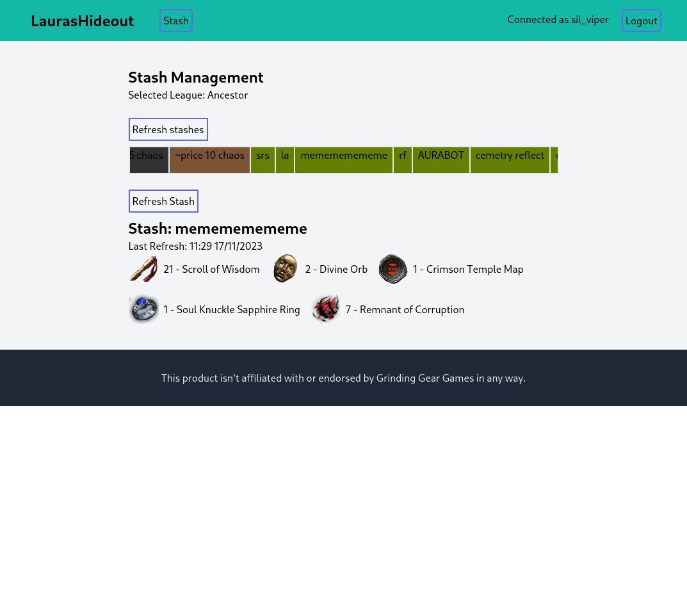

# LaurasHideout

Webserver using [Path of Exiles Developer API](https://www.pathofexile.com/developer/docs/index) to show the content of stash tabs.

Demo may be available at https://www.lauras-hideout.com/

## Features

+ Authentication using OAuth
+ Honours Rate Limits for the Developer Api
+ Retrieve stash tabs from user
  + Get list of all stash tabs
  + Select Stash Tab
  + Retrieve Item list of selected Stash Tab

## How to run

### Application

To run this you first need to register an application with GGG. Account scopes are listed in the `LaurasHideout.PoeApi.OAuth.account_scopes()` function.

The system token for scopes in the `service:...` are can be generated with this [http/rest file](.priv/utils/service_token.http).

### Environment Variables

Copy `.env.example` to `.env` and fill the variables.

### Development

A postgres instance is expected check [dev.exs](config/dev.exs) for mor details.

Run either with `mix phx.server` or `iex -S mix phx.server`

## Screenshot

